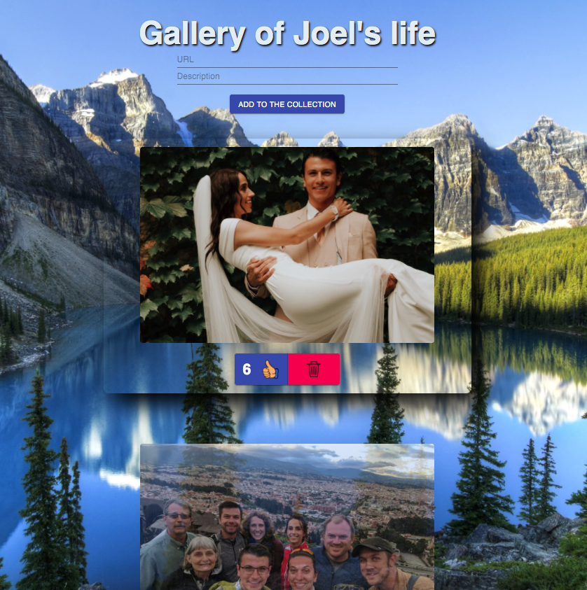

# PROJECT NAME
React Photo Gallery

## Description

_Duration: 2 Days_

This is Joel Roske's full stack React App.

## Screen Shot

### Prerequisites

- [Node.js](https://nodejs.org/en/)
- [Postgres](https://www.postgresql.org/download/)
- [Material UI](https://material-ui.com/)

## Installation

1. Create a database named `react_gallery`.
2. The queries in the `database.sql` file are set up to create all the necessary tables and populate the needed data to allow the application to run correctly. The project is built on [Postgres](https://www.postgresql.org/download/), so you will need to make sure to have that installed. We recommend using Postico to run those queries as that was used to create the queries. 
3. Open up your editor of choice and run an `npm install`
- Make sure you also have `express`, `axios`, and `pg` installed
4. Run `npm run server` in your first terminal
5. Run `npm run client` in your second terminal
6. The `npm run client` command will open up a new browser tab for you!

## Usage

1. On loading the page, the user will see a transparent form to add a photo to the gallery. If you have already set up your database and inserted the provided images, then you will see a column of those images via an Axios GET request.
2. The photos come in to focus when the user mouses over them, to keep focus to one image at a time.
3. Adding an image URL and description will add the image to the top of the feed after the user clicks the 'Add' button. This is done via an Axios POST request.
4. If the user clicks an image, the image is replaced by the image description via ternary conditional rendering. The user can click the description to see the photo again.
5. Users can 'like' photos by clicking the blue button with the thumbs up. Next to this button is the number of likes it already has. This is done with an Axios PUT request.
6. Users can delete images from the feed by clicking the red button with the bin. An alert will pop up asking the user to confirm deletion. If cancel is clicked, nothing happens. If OK is clicked, an Axios DELETE request deletes the image from the database and the DOM.

## Built With

The full stack! React, JSX, Javascript, CSS, Axios, Node, Express, and Postgres with SQL.

## Acknowledgement
Thanks to [Prime Digital Academy](www.primeacademy.io) who equipped and helped me to make this application a reality, well as the members of my cohort, Paxos.

## Support
If you have suggestions or issues, please email me at [joel.j.roske@gmail.com](www.google.com)